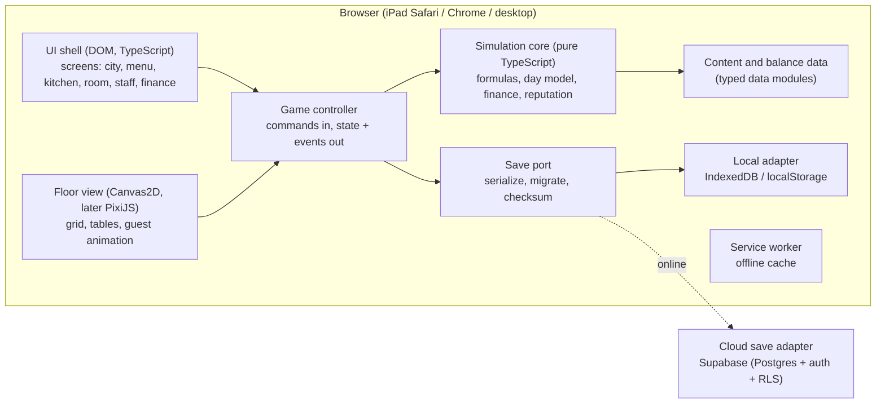
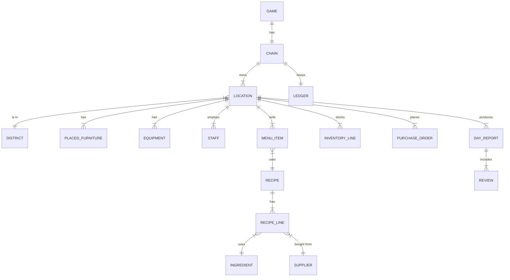

# Solution design: Pizza D

* Status: Draft 1, M0 build started
* Inputs: everything in `01-product/` (PRD with founder decisions of 2026-09-26)
* Companion files: `adrs/`, `infrastructure.md`

## 1. Constraints that drive the design

| Requirement | Source | Consequence |
|---|---|---|
| Browser only, iPad Safari and Chrome plus desktop, no native app | Founder decision | Web stack; WebKit is the real target platform |
| Free, no ads, no IAP, no tracking | Founder decision, PRD 10.1 | No third party SDKs; backend cost must stay near zero |
| Cloud saves across iPad and desktop, fully playable offline | Founder decision, A3, A4 | Local first saves with background sync; a small backend |
| Deep, legible economy that is tuned from data | PRD 5, 6, F-01, `balance.md` | Pure simulation core, all numbers in data files, balance tests in CI |
| Chain of up to 6 locations, most of them off screen | PRD 5.12 | Aggregate day model as the source of economic truth |
| 60 fps with 120 seated guests on an older iPad | M0 DoD, M13 | Game logic never runs per frame; the view animates results |
| Cosy, short sessions, exact resume | A9, A4 | Autosave on day end and on `visibilitychange` |

## 2. Challenge first

* **"Simulate every guest as an agent" is the known failure mode of tycoon games.** It makes the economy hard to test, slow on older iPads and impossible to run for six off screen locations. We keep one **aggregate day model** (the formulas in `balance.md`) as the only authority on money, covers and reputation, and let the view generate a guest animation that is consistent with those numbers. This removes a whole class of "agent sim and calculator disagree" bugs (AC-72 becomes true by construction).
* **A game engine is not needed for M0 to v0.1.** Most screens are forms, tables and cards (menu, purchasing, staff, P&L), which the DOM does better than any canvas engine. Only the restaurant floor needs a canvas. We start with Canvas2D and move the floor to PixiJS only if sprite counts demand it.
* **A backend is a cost and a liability for a free game.** Cloud save is the only server feature. It is a single table of versioned save blobs behind an interface, so the provider can be swapped or self hosted.

## 3. Architecture overview

**Rule:** `src/sim` imports nothing from the DOM, the UI, the save layer or any npm package. It is plain TypeScript that runs in Node for tests and in the browser for play. This is enforced by a lint rule on import paths (ADR-002).

## 4. Components

| Component | Folder | Responsibility | Talks to |
|---|---|---|---|
| Simulation core | `src/sim/` | Game state types, formulas, day model, finance, reputation, staff, commands, seeded RNG | Data only |
| Content and balance data | `src/data/` | Districts, segments, ingredients, tiers, suppliers, recipes, equipment, furniture, staff roles, traits, all tunables | Nothing |
| Game controller | `src/game/` | Holds current state, applies commands, emits events, triggers autosave | Sim, save |
| Save layer | `src/save/` | Serialize, version, migrate, checksum; local and cloud adapters; sync | Controller, browser storage, cloud |
| UI shell | `src/ui/` | Screens, panels, HUD; reads state, dispatches commands | Controller |
| Floor view | `src/ui/floor/` | Grid rendering, build mode placement, guest animation from day results | Controller |
| Balance harness | `tests/balance/` | Reference builds and strategy checks from `balance.md` section 3 | Sim, data |

## 5. Simulation core

### 5.1 Commands in, events out

The core is a reducer: `apply(state, command) -> { state, events }`. State is a plain JSON serialisable object; commands are plain objects; the core never mutates its input.

| Command | Effect |
|---|---|
| `newGame { seed, districtId }` | Creates a game with starting cash and a starter property |
| `setRecipeTier { recipeId, ingredientId, tier }` | Changes an ingredient tier in a recipe |
| `setRecipeSupplier { recipeId, ingredientId, supplierId }` | Changes the supplier for that line |
| `setPrice { itemId, price }` | Sets a menu price |
| `toggleMenuItem { recipeId, on }` | Adds or removes a dish (4 to 16 items) |
| `placeFurniture { itemId, x, y, rot }` / `removeFurniture { uid }` | Dining room build mode (80% refund) |
| `buyEquipment { itemId }` / `sellEquipment { uid }` | Kitchen equipment (80% refund) |
| `hire { candidateId }` / `fire { staffId }` / `giveRaise { staffId }` | Staff |
| `takeLoan { amount }` / `repayLoan { amount }` | Finance |
| `runDay {}` | Simulates one full service day and settles money |

| Event | Used by |
|---|---|
| `dayCompleted { report }` | End of day summary, floor animation, reviews, P&L |
| `bottleneck { kind, value }` | Advisor banner |
| `milestoneReached { id }` | Unlocks, ranks |
| `cashBelowZero`, `restructureOffered` | Safety net |
| `staffNotice { staffId }` | Staff |

### 5.2 Day model (hybrid simulation)

1. **Aggregate pass (authoritative).** For each segment and each service (lunch, dinner) compute demand with the `balance.md` 1.4 formulas, dish choice by logit, kitchen and seat capacity, utilisation, queue delay, served covers and walk aways, satisfaction, reviews and money. Random elements (party sizes, delivery failures, which parties review, review texts) come from a seeded PRNG stored in state, so a day is exactly reproducible.
2. **Presentation pass (view only).** The floor view turns the day report into a stream of parties (arrival times, table, dish, mood) using a PRNG seeded from the day. It never feeds back into money or reputation.
3. **Off screen locations** (v1.0 chain) run the aggregate pass only, with the manager or caretaker modifiers.

Cost of this choice: interventions during service (comping a dessert, closing a table mid service) must be modelled as modifiers on the next aggregate pass or as small adjustments to the current report. The PRD's interventions are few and fit this.

### 5.3 Time

* The day is resolved in one step (`runDay`). The UI plays it back at the chosen speed (1x, 2x, 4x, pause) using `real_seconds_per_game_minute`. Pausing or skipping the playback never changes the outcome.
* Weekly events (salaries, rent, loan payment, hiring board refresh) happen on Sunday night inside `runDay`.

### 5.4 Determinism

* PRNG: mulberry32 with the seed in state; each subsystem derives its own stream from `(seed, day, subsystem)` so adding a new random call in one system does not shift another.
* No `Date.now()`, `Math.random()` or floating time inside `src/sim` (lint rule).

## 6. Data model (key entities)

| Entity | Key fields |
|---|---|
| District (data) | id, footTraffic, segment shares, wealth, competition, rentPerTile, lunchShare |
| Segment (data) | id, elasticity, budget, qualityAppeal, qualityWeight, waitTolerance, mealLength, partySize, likedTags, speedAppealAtLunch |
| Ingredient (data) | id, category, tags, baseCost per portion, shelfLifeDays, storage type, tiers available |
| QualityTier (data) | id (basic, standard, premium, artisan), quality, priceMult, shelfLifeMult |
| Supplier (data) | id, priceIndex, qualityOffset, reliability, leadDays, minOrder, tiers carried per category |
| Recipe (state) | id, name, kind (pizza, starter, drink, dessert), lines (ingredientId, tier, supplierId, portion), tags, price, onMenu |
| Equipment (data + state) | itemId, family, price, slots, bakeMult, prepMult, qualityMod, skillNeeded, footprint, maintenance, unlock; state holds uid |
| Furniture (data + state) | itemId, kind (table, decor), seats, decorPoints, footprint, price; state holds uid, x, y |
| Staff (state) | id, name, role, skill, potential, fame, traits, morale, salary, shiftsWorked |
| InventoryLine, PurchaseOrder (state, v0.1) | ingredientId, tier, supplierId, qty, expiryDay; order lines, due day, status |
| DayReport (state) | day, per segment demand and served, covers, walk aways, bottleneck, satisfaction breakdown, reviews, P&L lines, cash flow |
| Ledger (state) | cash, loan balance, weekly accruals, history of daily P&L |

## 7. Content and balance as data

* All numbers in `balance.md` live in `src/data/*.ts` as typed constant objects (`as const satisfies Schema`). TypeScript checks shape at build time; a data validation test checks ranges against the "safe range" column.
* Designers change a number in one file; the balance harness in CI shows the effect on the reference builds. A diff in `src/data` is a balance change and is reviewed as such.
* Why TypeScript modules rather than JSON: type checking and comments for free, no runtime schema library. If non engineers need a spreadsheet later, a small script can export and import CSV (ADR-004).

## 8. Saves and cloud sync

* Save = `{ schemaVersion, gameVersion, savedAt, revision, deviceId, checksum, state }` as JSON.
* **Local first:** autosave after every `runDay` and on `visibilitychange` to hidden (iPad Safari may kill a background tab without warning). M0 uses `localStorage`; v0.1 moves to IndexedDB for size.
* **Migrations:** an ordered list `migrations[n]: (stateVn) => stateVn+1`, tested with a fixture save for every past version.
* **Cloud (v0.1):** Supabase with anonymous sign in (upgradable to an email magic link to use a second device). One table `saves(user_id, slot, revision, updated_at, blob)` protected by row level security. Sync on load, after autosave when online, and on focus.
* **Conflicts:** each save carries a `revision` and the `baseRevision` it was derived from. If the cloud revision moved on since the local base, the game shows both saves (day, cash, stars, device, time) and lets the player pick. No silent overwrites of progress.
* Supabase is open source and self hostable, so the exit path is the same schema on our own Postgres (ADR-005).

## 9. Non functional targets

| Area | Target |
|---|---|
| Frame rate | 60 fps at 1x with 120 seated guests on the minimum iPad (candidate: iPad 9th gen, A13); 30 fps floor at 4x |
| `runDay` cost | under 5 ms per location on the minimum iPad; a 6 location chain day under 30 ms |
| Load | first load under 2 MB gzipped before art; playable offline after first visit |
| Memory | under 300 MB on iPad Safari |
| Battery | render loop stops when nothing animates or the tab is hidden |
| Privacy | no third party scripts; strict CSP; only the cloud save endpoint is contacted |
| Accessibility | 44 px touch targets, text size setting, colour blind safe palette, no hover only interactions |

## 10. Failure modes

| Component | Failure | Impact | Mitigation |
|---|---|---|---|
| Browser storage | Safari evicts site data after weeks without use (ITP) or in low storage | Local save lost | Cloud save; ask for persistent storage (`navigator.storage.persist`); installed home screen apps are exempt from the 7 day rule |
| Tab lifecycle | iPad kills a hidden tab | Lost progress since last save | Autosave on `visibilitychange`; days are atomic |
| Cloud backend | Down or offline | No sync | Game keeps working locally, sync retries with backoff, badge shows "not synced" |
| Sync | Two devices played offline | Diverging saves | Revision check and explicit player choice |
| Service worker | Stale cached build | Old code with new save | Versioned cache, update prompt at day end, saves carry `schemaVersion` and refuse to load in older code |
| Save migration | Bug in a migration | Corrupt game | Fixture tests per version; keep previous save slot; checksum |
| Simulation | Formula change breaks balance | One strategy dominates | Balance harness in CI fails the build |
| Rendering | Too many sprites on old iPad | Stutter | Floor view caps animated guests and batches drawing; PixiJS path (ADR-003) |

## 11. PRD items that are risky or under specified

| Item | Risk | Question that resolves it |
|---|---|---|
| Taste match (5.7) | Used in menu fit, choice and satisfaction but not defined | Proposed and implemented: `taste_match = min(1, 0.1 + 0.45 x liked tags on the dish)`; reproduces the worked example within 5%. Game design to confirm. |
| Agent sim must match calculator within 10% (AC-72) | Two models drift | Resolved by design: the aggregate model is the only authority (section 5.2) |
| Apple Pencil hover (F-07, AC-20) | Browser support is partial | Keep as progressive enhancement via Pointer Events `pointerType = pen`; drop hover requirement |
| Offline plus cloud saves | Conflicts | Explicit conflict chooser (section 8) |
| Performance on the oldest iPad (Q6) | Unknown floor | M0 performance spike with the floor view |
| Purchasing with lead times in M0 | Adds UI before the maths is proven | M0 buys ingredients just in time at the chosen tier and supplier, with tier waste rates; orders, storage and spoilage arrive in v0.1 |

## 12. M0 technical plan (build order)

1. Repo scaffold: Vite, TypeScript strict, Vitest, ESLint, GitHub Actions CI (typecheck, lint, test, build).
2. `src/data`: districts, segments, tiers, suppliers, ingredients, recipes, equipment, furniture, staff roles and traits from `balance.md`.
3. `src/sim/formulas.ts`: quality, fair price, demand, choice, capacity, service time, queue delay, satisfaction, reviews, reputation. Unit tests per formula against the worked numbers in `balance.md` 2.2 to 2.5.
4. `src/sim/day.ts`: the aggregate day model and P&L. Golden test: starter restaurant day (`balance.md` 2) within tolerance.
5. Balance harness: the three reference builds in three districts (`balance.md` 3) and the checks in 3.5.
6. Commands and state: new game, menu, tiers, prices, equipment, furniture, staff, loans, run day, weekly settlement, safety net.
7. Save layer: serialize, version, local adapter, autosave.
8. Greybox UI: HUD, menu and recipe card with tier selectors, kitchen catalogue, dining room grid with build mode, staff board, day report with P&L and reviews, floor playback.
9. Deploy to static hosting; performance check on an iPad.

v0.1 then adds: purchasing, storage and spoilage; cloud save adapter; PixiJS floor if needed; art, audio, tutorial.
